### Feed Forward and Backward Run in Deep Convolution Neural Network

### 前言
一般来说，学习CNN的人都对卷积网络的具体运算过程比较了解，但是不会关注卷积网络在数学上是如何实现的。  

各大深度学习框架都提供了简洁的卷积层API，所以我们不需要数学表达式也能够构建各种各样的卷积层。
我们最多只需要关注卷积运算输入和输出的张量维度是多少就行。  

这样虽然能完美地实现网络，但我们对卷积网络的数学本质和过程仍然不是太清楚。   

本文将尝试概述卷积网络的架构，并解释包含激活函数、损失函数、前向传播和反向传播的数学推导。

### 简介
* Recent development in neural networks profoundly showed incredible results 
in object classification, pattern recognition, and natural language processing.
* Unlike machine learning, CovnNets can be fed with raw image pixel value 
rather than feature vectors as input. 
* The basic design principle of developing an CovnNets architecture and 
learning algorithm is that it reduces the number of the parameter without 
compromising the computational power of learning algorithm.
    * 设计卷积网络架构或学习算法的一个原则是：
    在不减少模型计算能力的情况下，尽量减少参数的数量。
* The convolution processes act as appropriate feature detectors that 
demonstrate the ability to deal with a large amount of low=leave information.
    * 卷积过程作为“适当的特征提取器(feature detector)”刻画了“处理大量低阶信息的能力”。
* 复杂的卷积层有不同的特征提取器，因此可以从同一幅图中提取多种特征。和整个输入图像相比，单个的特征提取器是非常小的，
而卷积操作就是在图像上滑动特征提取器。因此，在所有的输入单元上共享特征提取器的权重和偏置，
也就是说特征提取器可以在整个图像上检测同样的特征。
* 在架构中，像素之间的局部连接(local connection)被利用了许多次。在局部感受野(local respective field)中，
神经元可以提取基本特征(elementary features),例如，边的方向、角和端点等。
* 层与层之间的稀疏连接(sparse connectivity between subsequent layers)、
邻近像素的参数共享(parameter sharing of weights between the adjacent pixels)和
等同的表示(equivariant representation ???)使得CNN在图像识别和分类问题中非常高效。

### 架构
> 在本文中，使用灰度图(grey scale image)作为输入图像，
Relu和Sigmoid激活函数(activation function)作为卷积网络的非线性属性，
交叉熵损失函数(cross-entropy loss function)用于计算预测值(predicted value)和真实值(actual value)之间的距离。
该卷积网络架构包含一个卷积层(convolution layer)、池化层(pooling layer)和多个全连接层(稠密层, dense layer)。

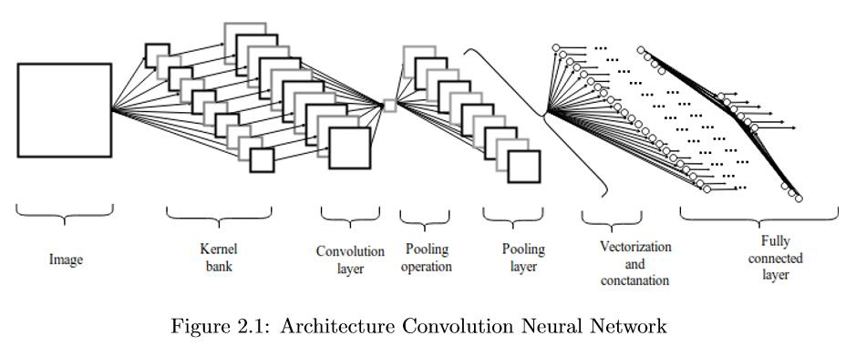

1. 卷积层 Convolution layers
    * 卷积层是一组平行的特征图，通过“在输入图像上滑动不同核(kernel, feature detector)”
    “映射”(the element-wise dot as the feature maps)而成，这个滑动过程称作“stride Z_s”。
    * This "kernel bank" is "smaller in size as compares with the input image" and
    are "overlapped on the input image" which "prompts the parameters such as weight and bias
    sharing between the adjacent pixel of the image" as well as "control the dimensions of feature maps".
        * 促使在相邻像素之间的“权重和偏置共享”
        * 可以控制特征图的维度
    * Using the small size of kernels often result in imperfect overlays and 
    limit the power of the learning algorithm. Zero padding Z_p process usually implemented to
    control the size of the input image.
        * 滑动卷积核时经常会出现不完美的覆盖，限制了模型的能力。通常通过补0来控制输入图像的大小。
    * filter bank with the dimension of (k_1, k_2, c),slide over input image that fixed size of (H, W, C).
        * 卷积核的维度为(k_1, k_2, c)，输入图像的维度为(H, W, C)。
    * The stride and zero padding are the critical measures to control the dimension of the convolution layers.
        * stride和pad zero时控制卷积层维度的关键因素。
    * As a result feature maps are produced which are stacked together to form the convolution layers.
        * 将产生的特征图堆叠在一起形成卷积层。
    
    * The dimension of the convolution layer can be computed by following Eqn. 2.1:  
        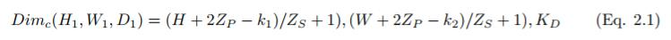

2. 激活层 Activation functions
    * “激活函数”定义了给定“一组输入”的神经元的输出
    * 通过“激活函数”将“网络输入值的线性加权和”进行“非线性转换”
    * 传统的激活函数是基于条件概率的，输出值为0或者1
    * Higher the net input value greater the activation.  
    
    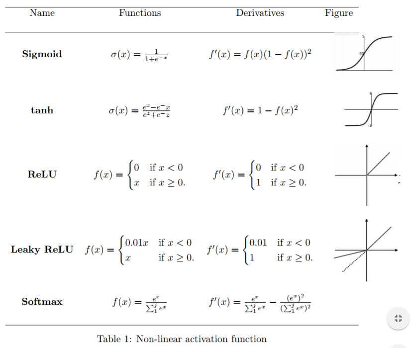

3. 池化层 Pooling layers
    * Pooling operations carried out after the nonlinear activation where the pooling
    layers help to reduce the number of data points and to avoid overfitting.
        * 池化层可以降低数据量、防止过拟合。
    * It also act as a smoothing process from which unwanted noise can be eliminated.
        * 池化层也可以作为光滑处理过程来去除噪声。
    * L2-Pooling:计算窗口内数据的2范数。
    
4. 全连接层 Fully connected dense layers
    * These vectorized and concatnated data points are fed into dense layers,
    known as fully connected layers for the classification.
    
5. 损失函数 Loss or cost function
    * Loss function is used to measure the performance of the model and 
    inconsistency between actual y and predicted value _y.
        * 损失函数用来评价模型的性能、真实值和预测值之间的不一致性。
    * Performance of model increases with the decrease value of loss function.
        * 模型的性能随着损失的减少而增加。
    * Many types of loss functions are developed for various applications.
    * 均方误差 Mean Squared Error
        * known as quadratic loss function(二次损失), mostly used in linear regression
        models to measure the performance.  
        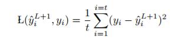
    * 均方Log误差 Mean Squared Logarithmic Error
        * MSLE  
        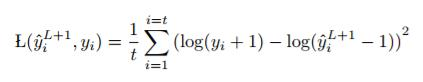
    * L2损失 L2 Loss function
        * L2 loss function is "square root of L2 norm" of the difference between actual
        labeled value and computed value from the net input.  
        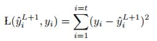
    * L1损失 L1 Loss function
        * L1 loss function is "sum of absolute errors" of the difference between actual labeled
        value and computed value from the net input.  
        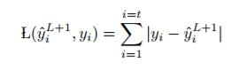
    * 平均绝对误差 Mean Absolute Error
        * MAE  
        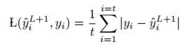
    * 平均绝对百分比误差 Mean Absolute Percentage Error
        * MAPE  
        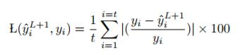
    * 交叉熵 Cross Entropy
        * The most commonly used loss function is Cross Entropy loss function.  
        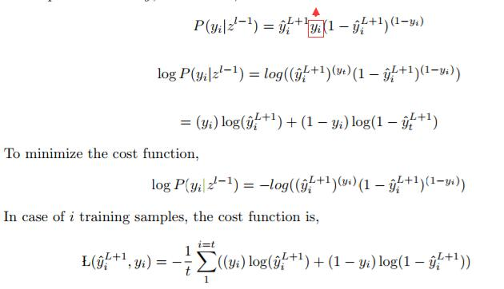

### 前向 Feed-Forward run
* In a discrete color space, image and kernel can be represented as a 3D tensor with the
dimension of (H,W,C) and (K1, K2, c) where m,n,c are represent the m_th,n_th pixel in c_th channel.
First two indices are indicate the spatial coordinates and last index is indicate the color channel.
    * 用(H,W,C)表示输入image的维度，用(K1,K2,C)表示kernel的维度，
    用(m,n,c)表示空间坐标和所属通道
* If a kernel is slided over the color image, the multidimensional tensor convolution
operation:  
    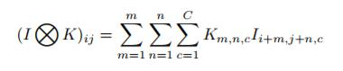
* For grey scale image,convolution process:  
    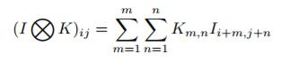
* The feature maps of the convolution layer can be computed by:  
    * 将下面公式中的求和部分换成上面的公式也许会好理解！  
    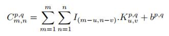
* These feature maps are passed through a non-linear activation function σ.
* Pooling layer is developed by taking out the maximum valued pixels m,n in the convolution layers.
* The pooling layer is concatenated to form a long vector with the length of p x q and is 
fed into fully connected dense layers for the classification. The long vector is fed into a 
fully connected dense layers from L layer to L+1.  
    
* The performance of the model can be computed by loss function, such as:  
    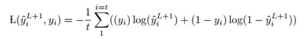

### 反向 Backward run
* During the backward propagation, gradient of loss function of final layers with respect
to the parameters is computed first where the gradient of first layer is computed last.
* Primary function of pooling layer is "reduce the number of parameters" and also to
"control the overfitting of the model",so no learning takes place in pooling layers.
The pooling layer error is computed by "acquiring single value winning unit".
* what fuck!

### 参数更新 Parameter updates
* In order to minimize the loss function, it is necessary to update the learning parameter at
every iteration process on the basis of gradient descent.

### Reference

* [Feed Forward and Backward Run in Deep Convolution Neural Network](https://arxiv.org/pdf/1711.03278.pdf)

* [徒手实现CNN：综述论文详解卷积网络的数学本质](https://mp.weixin.qq.com/s/qIdjHqurqvdahEd0dXYIqA)
